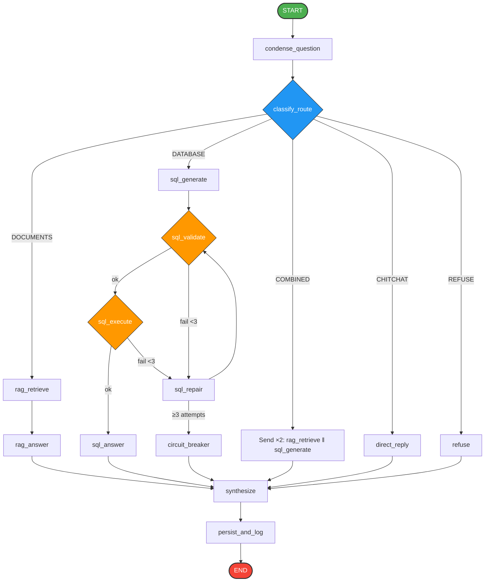

```mermaid
graph TD
    %% Define Nodes
    START([START]) --> condense_question[condense_question]
    condense_question --> classify_route{classify_route}

    %% Routes from classify_route
    classify_route -->|DOCUMENTS| rag_retrieve[rag_retrieve]
    classify_route -->|DATABASE| sql_generate[sql_generate]
    classify_route -->|COMBINED| sql_rag_split[Send ×2: rag_retrieve ‖ sql_generate]
    classify_route -->|CHITCHAT| direct_reply[direct_reply]
    classify_route -->|REFUSE| refuse[refuse]

    %% Main Document Path
    rag_retrieve --> rag_answer[rag_answer]

    %% Main Database Paths
    sql_generate --> sql_validate{sql_validate}
    
    %% Validation Loops & Circuit Breaker
    sql_validate -->|ok| sql_execute{sql_execute}
    sql_validate -->|fail <3| sql_repair[sql_repair]
    
    sql_execute -->|ok| sql_answer[sql_answer]
    sql_execute -->|fail <3| sql_repair
    
    sql_repair --> sql_validate
    
    sql_repair -->|≥3 attempts| circuit_breaker[circuit_breaker]

    %% Convergence to Synthesis & End
    rag_answer --> synthesize[synthesize]
    sql_answer --> synthesize
    sql_rag_split --> synthesize
    direct_reply --> synthesize
    refuse --> synthesize
    circuit_breaker --> synthesize

    %% Final Steps
    synthesize --> persist_and_log[persist_and_log]
    persist_and_log --> END([END])

    %% Styling
    style START fill:#4CAF50,stroke:#333,stroke-width:2px,color:#fff
    style END fill:#f44336,stroke:#333,stroke-width:2px,color:#fff
    style classify_route fill:#2196F3,stroke:#333,stroke-width:1px,color:#fff
    style sql_validate fill:#ff9800,stroke:#333,stroke-width:1px,color:#fff
    style sql_execute fill:#ff9800,stroke:#333,stroke-width:1px,color:#fff
```
